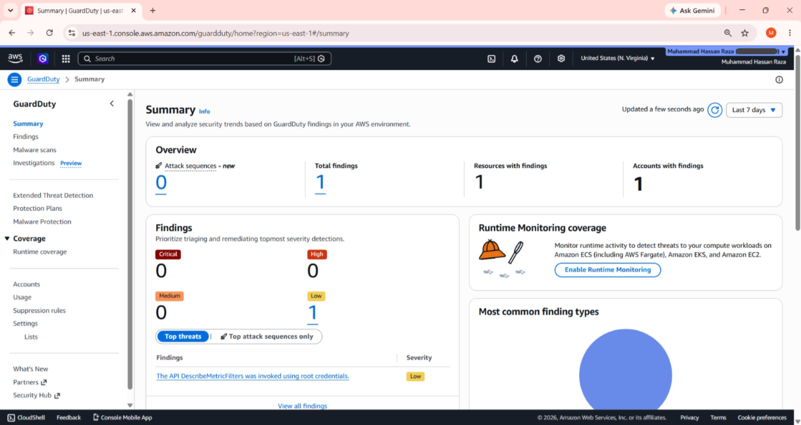
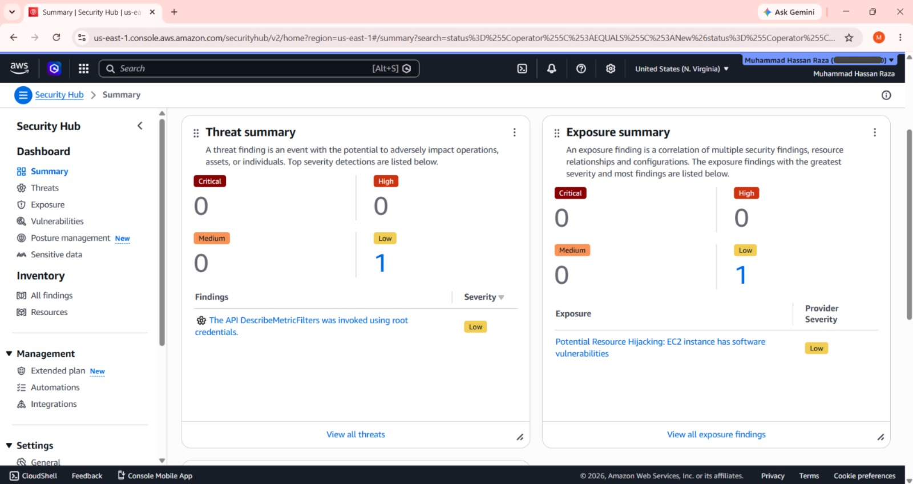
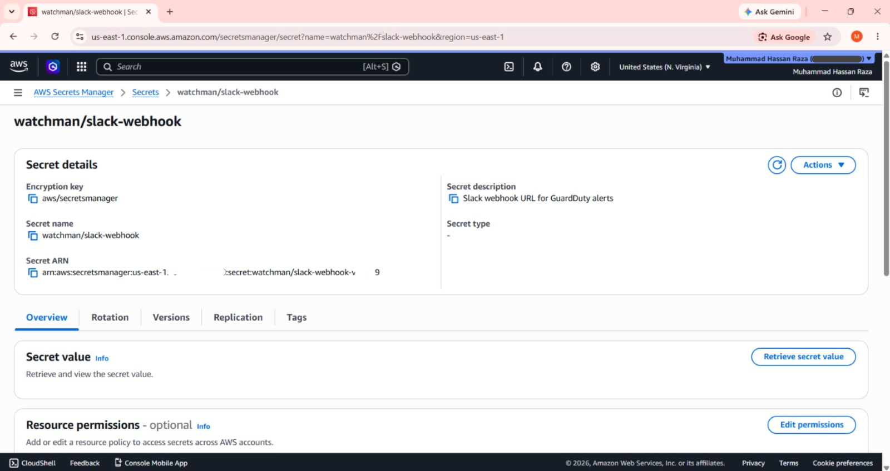
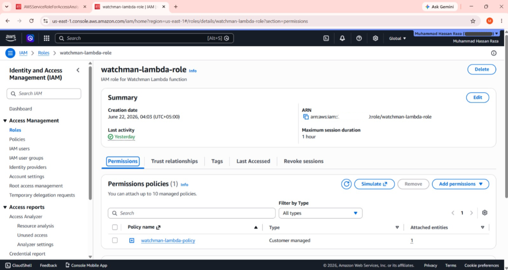
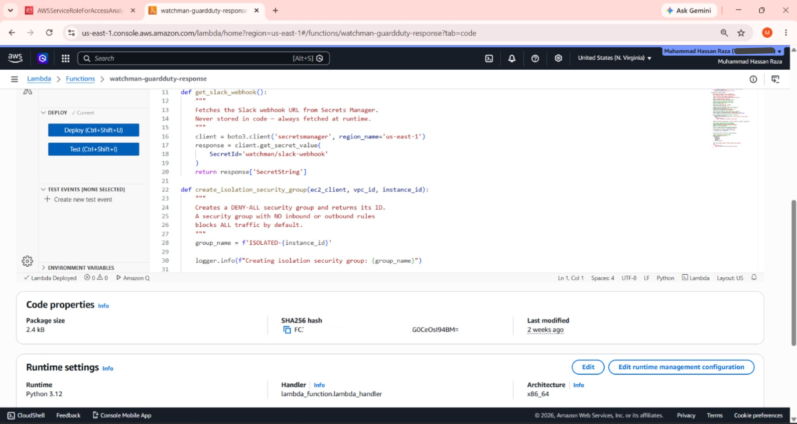
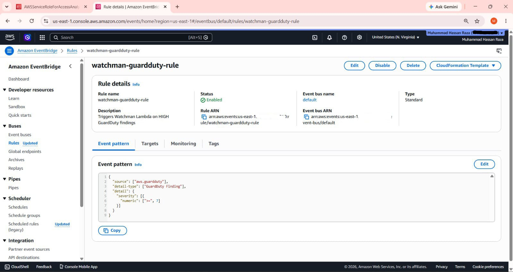
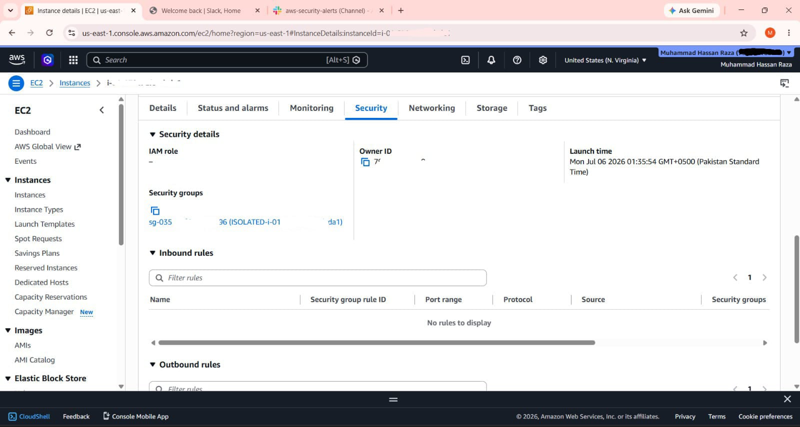
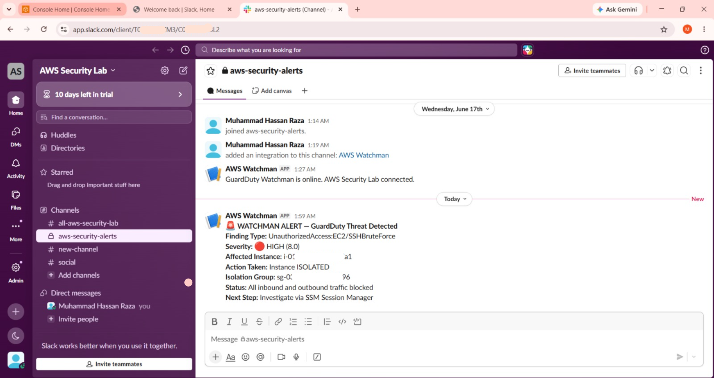

# 🛡️ The Watchman
### Automated AWS Threat Detection & EC2 Isolation

Project 04 of the Cloud Security Engineering.  
**Muhammad Hassan Raza** | [Portfolio](https://hassan-raza-me.vercel.app) | [LinkedIn](https://linkedin.com/in/muhammad-hassan-raza-5a2749322)

---

## What This Project Does

The Watchman is a fully automated cloud security response system. When AWS GuardDuty detects a HIGH severity threat against an EC2 instance, this system:

1. **Detects** the threat via GuardDuty
2. **Routes** the finding through EventBridge
3. **Isolates** the compromised EC2 automatically (removes all security groups, attaches DENY-ALL)
4. **Alerts** the security team via Slack with finding details and action taken

All within seconds. No human intervention required.

---

## Architecture

```
GuardDuty          EventBridge           Lambda
(detects)    →     (severity ≥ 7)  →    (responds)
                                          │
Security Hub                              ├── Isolate EC2
(compliance)                              │   (DENY-ALL group)
                                          │
                                          └── Slack Alert
                                              (finding details)
```

---

## AWS Services Used

| Service | Purpose |
|---------|---------|
| Amazon GuardDuty | Threat detection via VPC Flow Logs, CloudTrail, DNS |
| AWS Security Hub | Finding aggregation + CIS compliance scoring |
| AWS Secrets Manager | Secure Slack webhook storage (KMS encrypted) |
| AWS Lambda | Automated incident response (Python 3.12) |
| Amazon EventBridge | Routes HIGH findings to Lambda |
| AWS IAM | Least-privilege execution role |
| AWS CloudWatch | Lambda execution logging |

---

## Security Design Decisions

**Why Secrets Manager for the webhook URL?**  
Hardcoding credentials in Lambda code is a critical security risk — exactly the kind of exposure handled in a real GitGuardian incident. Secrets Manager stores the URL encrypted with KMS. Lambda fetches it at runtime. Nothing sensitive ever touches the codebase.

**Why DENY-ALL and not just remove inbound rules?**  
Removing only inbound rules leaves outbound traffic open. A compromised EC2 can still exfiltrate data, download malware, and call command-and-control servers through outbound connections. True isolation requires blocking both directions simultaneously.

**Why severity threshold of 7 (HIGH)?**  
Isolating an EC2 is a significant action that takes down running services. LOW and MEDIUM findings (1-6.9) are informational or low-confidence. Triggering isolation on every finding would cause alert fatigue and unnecessary downtime. HIGH and CRITICAL findings represent confirmed, high-confidence threats requiring immediate action.

**Why not terminate the EC2 instead of isolating?**  
Termination destroys forensic evidence. Isolation preserves the instance exactly as the attacker left it — files, processes, logs, memory — for investigation. After forensics, termination and rebuild from a clean AMI is the correct path.

---

## Project Structure

```
the-watchman/
├── lambda/
│   └── lambda_function.py      # Lambda Handler
├── policies/
│   ├── trust-policy.json       # IAM Trust Policy
│   └── permission-policy.json  # IAM Permission Policy
├── tests/
│   └── test-event.json         # Sample GuardDuty Finding
├── screenshots/                # Deployment Evidence
│   ├── 01-GuardDuty-Enabled.png
│   ├── 02-Security-Hub-Dashboard.png
│   ├── 03-Secrets-Manager-Secret.png
│   ├── 04-IAM-Role-Permissions.png
│   ├── 05-Lambda-Function-Code.png
│   ├── 06-EventBridge-Rule.png
│   ├── 07-EC2-Isolated.png
│   └── 08-Slack-Alert.png
└── README.md
```

---

## Deployment Guide

### Prerequisites
- AWS CLI configured
- Python 3.12
- An active AWS account
- Slack workspace with incoming webhook

### Step 1 — Enable GuardDuty
```bash
aws guardduty create-detector --enable --region us-east-1
```

### Step 2 — Enable Security Hub
```bash
aws securityhub enable-security-hub \
  --enable-default-standards --region us-east-1
```

### Step 3 — Store Slack Webhook
```bash
aws secretsmanager create-secret \
  --name "watchman/slack-webhook" \
  --secret-string "YOUR_SLACK_WEBHOOK_URL" \
  --region us-east-1
```

### Step 4 — Create IAM Role
```bash
aws iam create-role \
  --role-name watchman-lambda-role \
  --assume-role-policy-document file://policies/trust-policy.json

aws iam create-policy \
  --policy-name watchman-lambda-policy \
  --policy-document file://policies/permission-policy.json

aws iam attach-role-policy \
  --role-name watchman-lambda-role \
  --policy-arn arn:aws:iam::ACCOUNT_ID:policy/watchman-lambda-policy
```

### Step 5 — Deploy Lambda
```bash
cd lambda && zip function.zip lambda_function.py

aws lambda create-function \
  --function-name watchman-guardduty-response \
  --runtime python3.12 \
  --role arn:aws:iam::ACCOUNT_ID:role/watchman-lambda-role \
  --handler lambda_function.lambda_handler \
  --zip-file fileb://function.zip \
  --timeout 30 \
  --memory-size 128
```

### Step 6 — Create EventBridge Rule
```bash
aws events put-rule \
  --name watchman-guardduty-rule \
  --event-pattern '{"source":["aws.guardduty"],"detail-type":["GuardDuty Finding"],"detail":{"severity":[{"numeric":[">=",7]}]}}' \
  --state ENABLED

aws events put-targets \
  --rule watchman-guardduty-rule \
  --targets "Id=WatchmanLambdaTarget,Arn=arn:aws:lambda:us-east-1:ACCOUNT_ID:function:watchman-guardduty-response"
```

### Step 7 — Test
```bash
aws lambda invoke \
  --function-name watchman-guardduty-response \
  --payload fileb://tests/test-event.json \
  response.json && cat response.json
```

Expected result:
```json
{"statusCode": 200, "body": "Instance i-xxxx isolated successfully"}
```

---

## Screenshots

| What | Screenshot |
|------|-----------|
| GuardDuty enabled |  |
| Security Hub dashboard |  |
| Secrets Manager secret |  |
| IAM role and policies |  |
| Lambda function code |  |
| EventBridge rule |  |
| EC2 isolated |  |
| Slack alert received |  |

---

## What I Learned Building This

- How GuardDuty reads VPC Flow Logs, CloudTrail, and DNS logs to detect threats without agents.
- How EventBridge routes AWS service events to targets based on JSON pattern matching.
- Why IAM roles use temporary credentials instead of username/password for services.
- The difference between inbound and outbound isolation and why both directions must be blocked.
- How KMS encrypts secrets at rest in Secrets Manager and why ARN wildcards are needed.
- Why containment over availability is the correct security posture during an active incident.

---

*Part of the 2-Year Cloud Security Engineering Roadmap*  
*Nawabshah, Sindh, Pakistan → Global Cloud Security Engineer*
